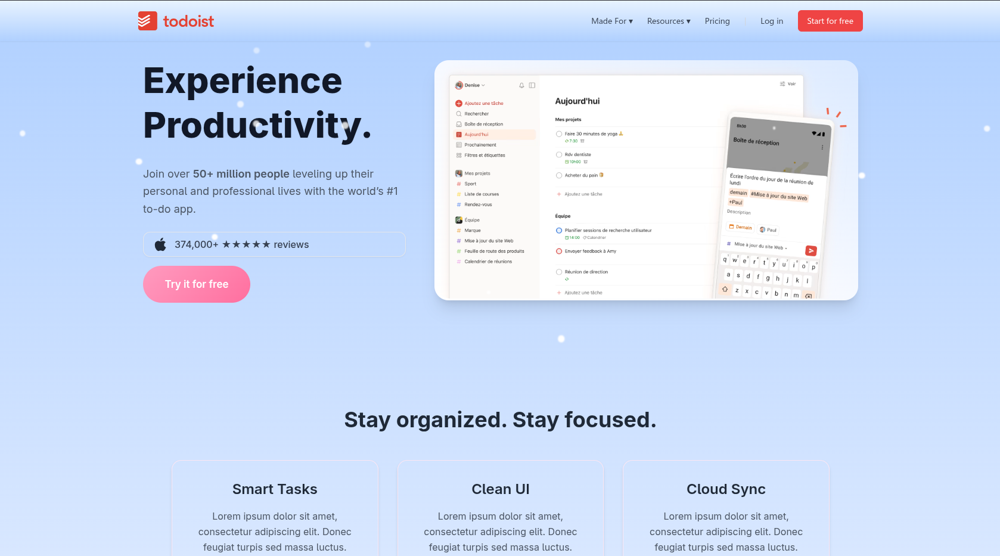
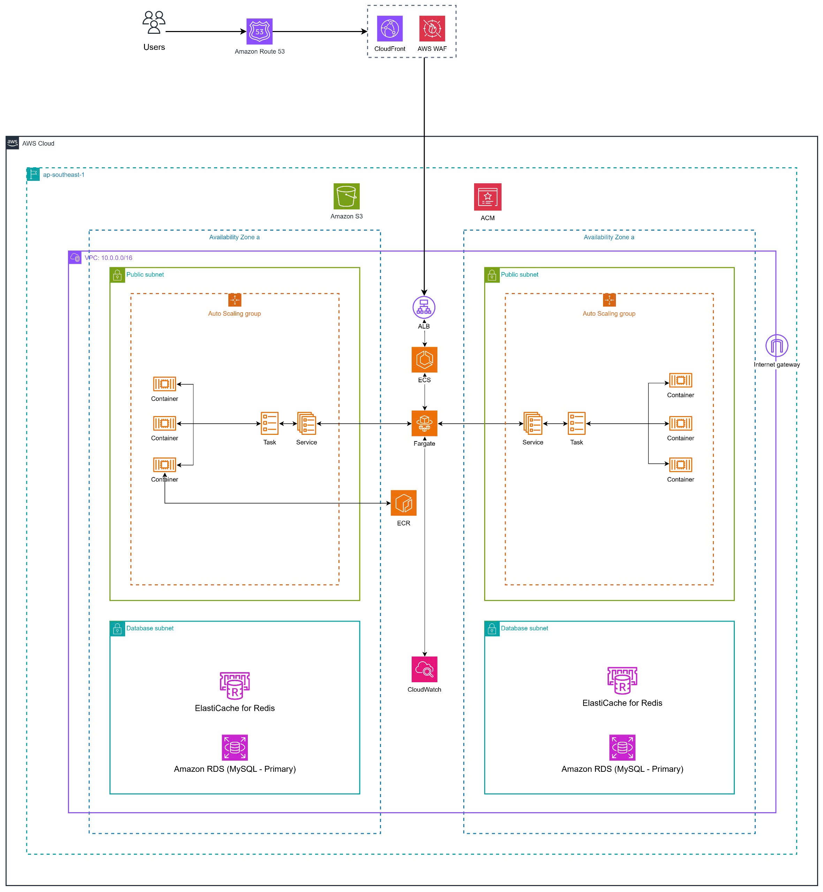

---

# 📝 AWS TODOLIST 1.0 — Microservices Project

## 🚀 Giới thiệu

**AWS TODOLIST** là hệ thống quản lý công việc được xây dựng theo kiến trúc **Microservices**, kết hợp backend Spring Boot, frontend React và hạ tầng AWS ECS Fargate.
Dự án hướng đến khả năng mở rộng, CI/CD hoàn chỉnh và mô hình triển khai chuẩn hóa trên AWS.

📌 *Bản hiện tại: **v1.0** — Một số tính năng còn hạn chế và có thể phát sinh lỗi. Các phiên bản sau sẽ tiếp tục cải thiện.*

🎥 **Video demo YouTube**: [https://youtu.be/gOVHkb54aeM](https://youtu.be/gOVHkb54aeM)

📄 **Hướng dẫn cài đặt (setup.md)**: [Xem tại đây](./setup.md)

---

## 🏠 Home



---

## 🧱 Kiến trúc tổng quan



---

## 🖥️ Microservices Backend

### 🔐 **Auth Service**

* Đăng ký, đăng nhập, refresh token
* JWT + Redis blacklist cho logout
* OAuth2 (Google)

### 📋 **Taskflow Service**

* CRUD Task/Todo
* Lọc, sort, phân trang
* **JPA Specifications** + Custom Filters

### 🔔 **Notification Service**

* Gửi email thông báo
* Gửi thông báo nội bộ của app
* Kafka làm message broker giữa các service

### 👤 **User Service**

* Các API liên quan đến người dùng
* Thông tin cá nhân, avatar, cập nhật hồ sơ
* Tách service để tối ưu mở rộng

### 🤖 **Model AI Service**

* Viết bằng **Flask**
* Phân loại nhãn / gợi ý tag cho task
* Nhận input từ Taskflow Service và trả prediction

### 🌐 **API Gateway**

* Spring Cloud Gateway
* Xác thực JWT trước khi định tuyến
* Entry point duy nhất của toàn hệ thống

---

## 🎨 Frontend

* **React + Vite**
* **Redux Toolkit**
* Axios Client + AxiosAdmin
* UI hỗ trợ phân trang, sort, filter
* Upload file qua form-data

---

## ☁️ Hạ tầng AWS

* **ECS Fargate** chạy từng microservice
* **Application Load Balancer** → API Gateway
* **ECR** lưu Docker images
* **RDS** (MySQL/PostgreSQL)
* **S3** (lưu file – optional)
* **CloudWatch Logs**
* **GitHub Actions** build & deploy tự động

---

## ⚙️ Công nghệ chính

### Backend

* Java **21**
* Spring Boot **3.4**
* Spring Security 6 (JWT + OAuth2)
* Spring Data JPA + Specifications
* Redis Cache
* Docker

### Frontend

* React
* Redux Toolkit
* TailwindCSS
* Axios

### DevOps

* AWS ECS Fargate
* AWS ECR
* AWS RDS
* Docker
* GitHub Actions CI/CD

---

Dưới đây là mục **Cấu trúc thư mục** đã được bổ sung đầy đủ và format đẹp để đồng bộ với README:

## 🗂 Cấu trúc thư mục

```

aws-todo-list-project/
│
├── todolist-backend/
│   ├── auth-service/
│   ├── taskflow-service/
│   ├── notification-service/
│   ├── user-service/
│   ├── model-ai-service/
│   ├── api-gateway/
│
├── todolist-frontend/
│
├── model/                # Các file liên quan đến train AI + code Model Service
├── docs/                 # Tài liệu (đa số lỗi thời, sẽ được cập nhật sau)
├── infrac/               # Bộ Postman, test, script setup linh tinh
│
└── setup.md

```

## 📄 Hướng dẫn cài đặt

👉 Xem chi tiết tại: **[./setup.md](./setup.md)**

---

