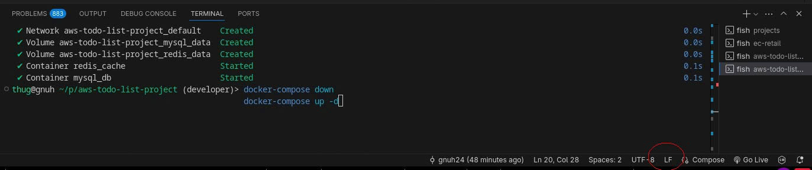

# AWS ToDo List Project - Setup Database (MySQL + Redis) bằng VSC

## **Bước 1: Cấu trúc project cần thiết**
**Lưu ý:** Folder của project **BẮT BUỘC** phải tên là `"aws-todo-list-project"` -> Nếu sai, lệnh CLI sẽ không nhận path -> lỗi.

```bash
aws-todo-list-project/
│
├─ todolist-database/
│   ├─ mysql-init.sql      # Script init dữ liệu MySQL
│   └─ redis-init.sh       # Script init dữ liệu Redis
│
└─ docker-compose.yml
```

> **Lưu ý:** Redis script cần chuyển sang **LF** nếu dùng Windows để tránh lỗi `: not found`.  
> Trên Linux/macOS: chạy lệnh `chmod +x todolist-database/redis-init.sh` để cấp quyền thực thi cho script.

## **Bước 2: Lệnh chạy Docker Compose setup toàn bộ MySQL và Redis (Bao gồm cả script dữ liệu mẫu)**

### **Trường hợp 1: Chưa có container/images (Chạy lần đầu)**
```bash
docker-compose up -d
```

Tạo container MySQL + Redis mới.

Init dữ liệu tự động chạy.


### **Trường hợp 2: Reset lại setup (Container + volumes đã tồn tại)**

> **Lưu ý:** Trên Windows, hãy chắc chắn file script sử dụng **LF** (mặc định Linux/macOS) thay vì **CRLF** (mặc định Windows) để tránh lỗi khi chạy shell.  
> Hình minh họa: 

Sau khi đã chắc chắn sử dụng **LF**, thực hiện các lệnh sau để reset toàn bộ setup:
```bash
docker-compose down
docker volume rm aws-todo-list-project_mysql_data
docker volume rm aws-todo-list-project_redis_data
docker-compose up -d

```